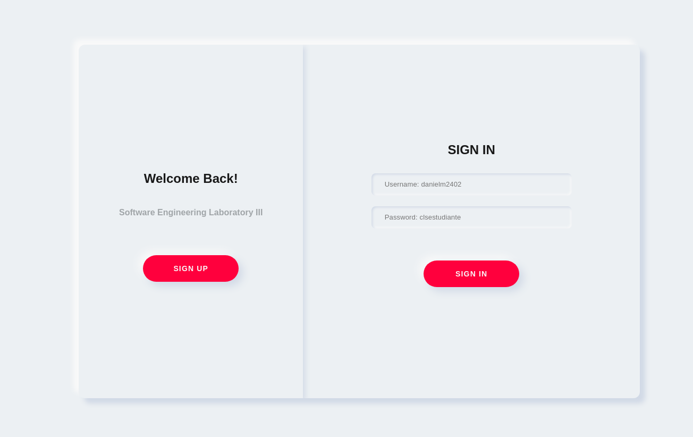
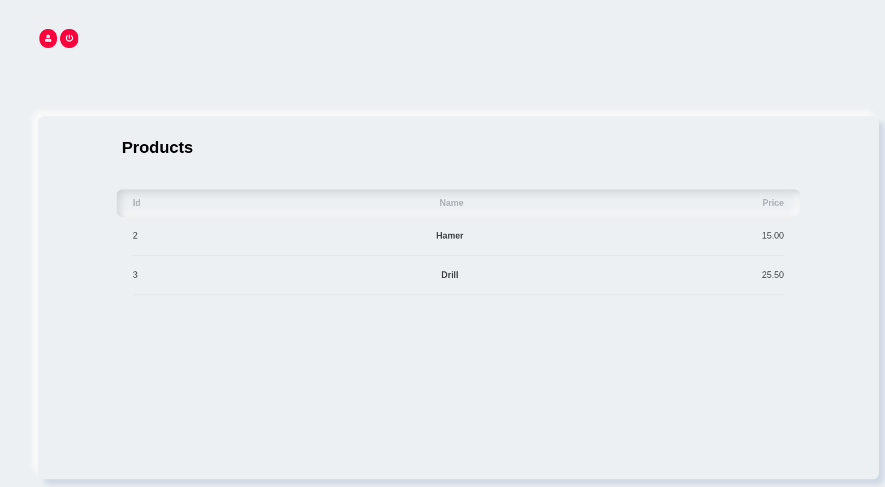
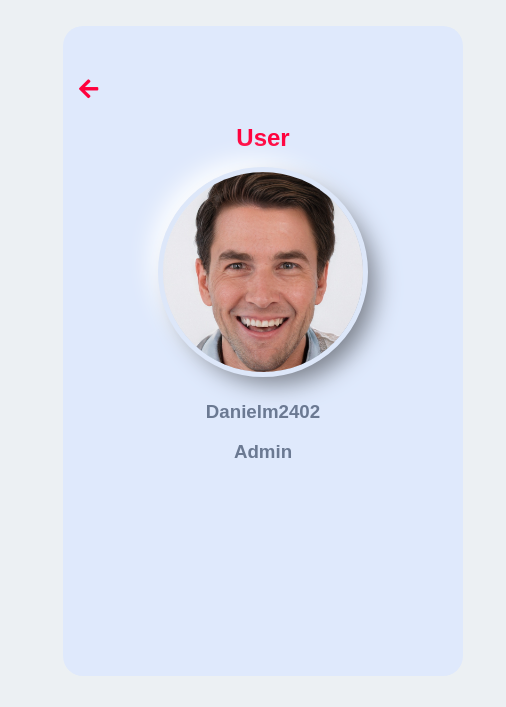

# PHP BASIC MVC EXAMPLE

### [You can see it here](http://185.117.73.82/index.php)

## Starting 🚀

_You can clone the repository to start. You can use xampp_

## Built with 🛠️

* [php](https://www.php.net/) - Programming language used
* html
* css

## Screenshots

---
made with ❤️ by [danielm2402](https://github.com/danielm2402) 😊
